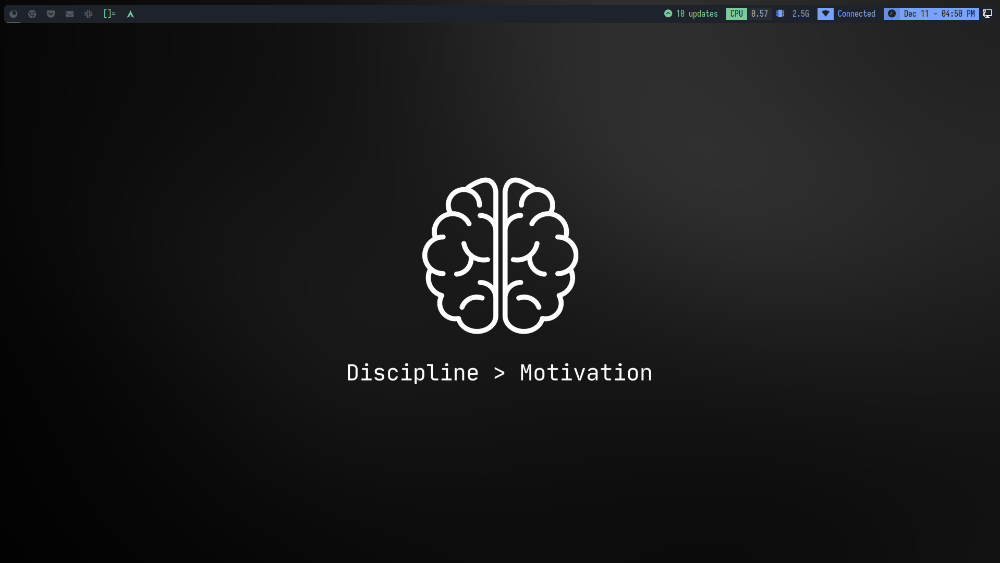
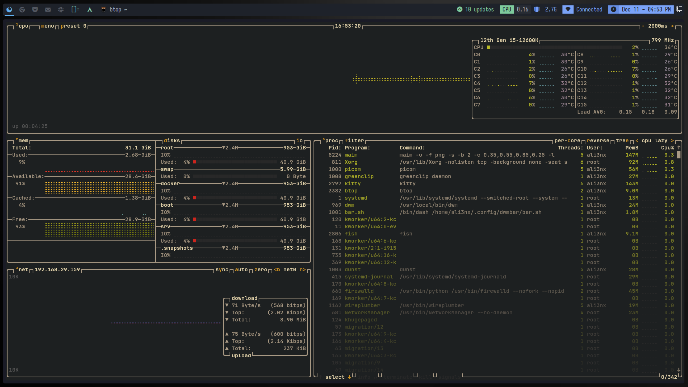

# Custom DWM Build




This is a custom build of DWM (Dynamic Window Manager) tailored to my personal preferences and workflow. The goal of this repository is to provide a streamlined and efficient version of DWM with additional features and configurations that suit my needs.

## Features

- **Custom Patches**: Includes various patches that add additional functionality to DWM. The following patches are applied:

|         |         |         |         |         |
|---------|---------|---------|---------|---------|
| `barpadding`        | `bottomstack`       | `cfacts`          | `dragmfact`       | `dragcfact`       |
| `fibonacci`         | `gaplessgrid`       | `horizgrid`       | `movestack`       | `vanity gaps`     |
| `colorful tags`     | `statuspadding`     | `status2d`        | `underline tags`  | `notitle`         |
| `winicon`           | `preserveonrestart` | `shiftview`       |                   |                   |

## Installation

### Arch Linux and Arch-based Distros (via pre-built release package)

If you're using Arch Linux or an Arch-based distro, you can easily install this custom DWM build using the pre-built release package provided in the GitHub releases.

1. **Download the Latest Release**

   Go to the [releases page](https://github.com/praneeth-katuri/dwm/releases) and download the latest `.tar.zst` package.

2. **Install the Package**

   Once you've downloaded the release package, you can install it using the following command:

   ```bash
   sudo pacman -U /path/to/dwm-release-package.tar.zst

## License

This project is licensed under the **MIT License**. See the [LICENSE](LICENSE) file for more information.

## Contributions

Contributions are welcome! If you'd like to contribute to this project.
